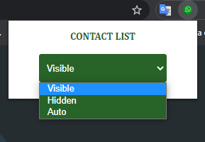
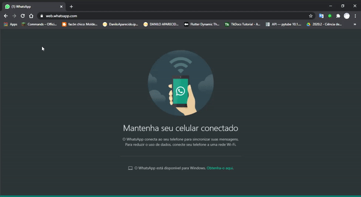

# HIDE CONTACTS CHROME EXTENSION FOR WHATSAPP WEB

With this extension you can hide and display your whatsapp web contacts bar. Setting the mode auto its hide when you move the mouse cursor to the left corner and hide when the cursor leave the bar.

Compatible with **Chrome**, **Opera**, **Firefox** and **MS Edge**.

## Instalation

Chrome/opera/edge | Firefox 
------ | ------ 
Go to `browser_name://extensions` |  Go to `about:debugging#/addons` 
Enable "Developer Mode" | Click "Load temporary Add-on" 
Drag and drop the folder or click "Load Unpacked" and select it | Select the file "manifest.json" 

# Usage

Open the pop-up and select your prefered option.

If you chose the option '*auto*' the contacts list will hide automaticaly and when you touch the left corner with the cursor it will display

*NEW FEATURES COMING SOON*
